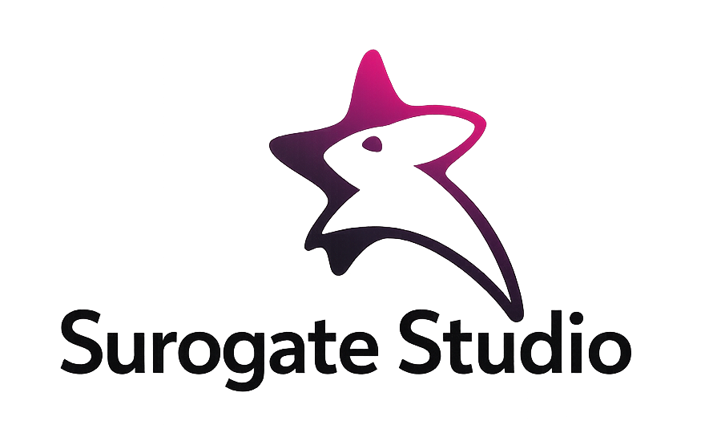
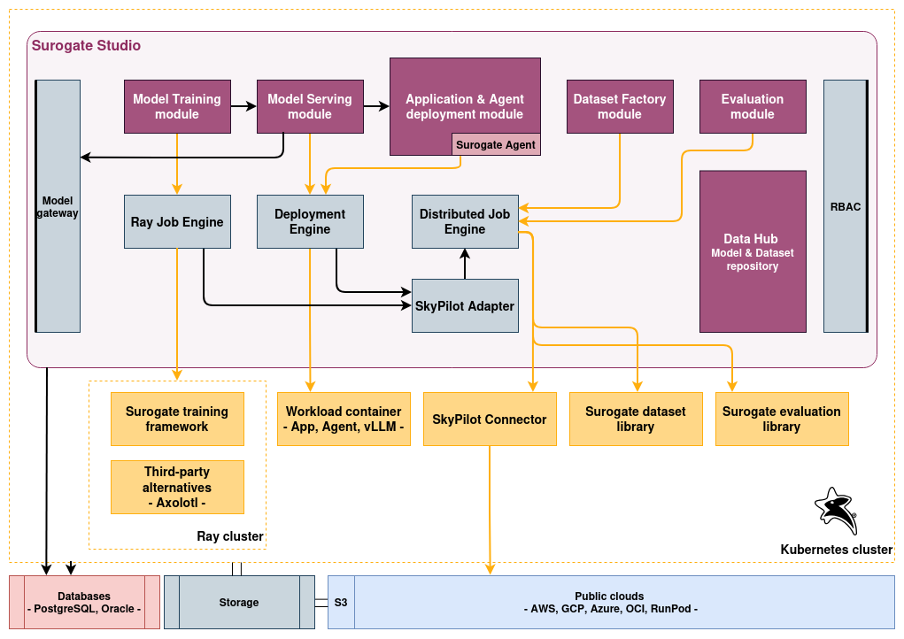
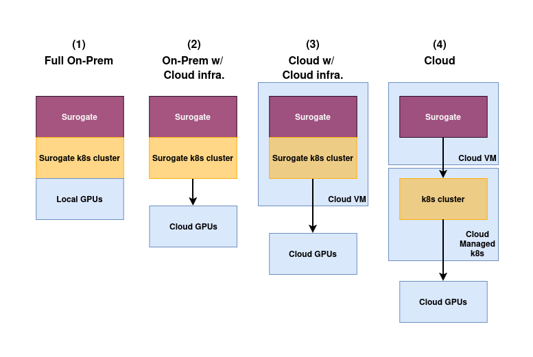
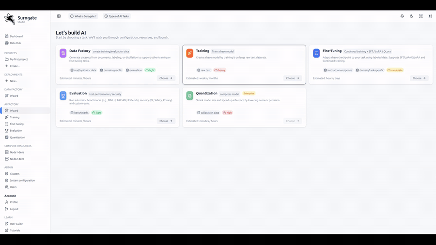

  

<h1 align="center">From experiment to enterprise — faster</h1>

  <em>Unified platform for LLM deployment, training, tuning, evaluation</em>

  <a href="https://demo.surogate.ai"><strong>Demo</strong></a>
  ·
  <a href="https://docs.surogate.ai"><strong>Docs</strong></a>

---

## What is Surogate Studio?

**Surogate Studio** is an enterprise-grade **LLMOps platform** built to accelerate the development and deployment of generative AI applications.

It unifies **deployment**, **fine-tuning**, **evaluation**, **safeguarding**, and **optimization** into a single platform — streamlining the journey from experimentation to reliable large-scale production adoption.

---

## Key Features

- KV-aware routing, GPU sharding, replicas, and disaggregated serving for production-grade performance.
- Git-like Data Hub for models & datasets.
- Multi-GPU; Multi-node (Ray-based).
- Import/Export from/to HuggingFace and ModelScope.
- Pretraining; full fine-tuning; LoRA / QLoRA.
- BF16, FP8, NVFP4, BnB; mixed-precision training.
- Native C++/CUDA engine; kernel fusions; multi-threaded scheduler.
- Experiment metrics with charts (Loss, Eval loss, Learning rate, Grad norm., Tokens per second).
- Logs and Test vLLM chat.
- Smart CPU offloading.
- Dense + MoE model support.
- Broad NVIDIA SM coverage.
- Integration with Axolotl and SOTA **[Surogate](https://github.com/invergent-ai/surogate)** training libraries.
- Benchmark with MMLU, ARC, GSM8k, TruthfulQA, HellaSwag, and more. Red-team for toxicity, bias, misinformation, PII, and harms.
- Custom benchmarks with judge and simulators.
- Workload deployment on local or remote Kubernetes clusters and on public clouds.
- Integrations with AWS, GCP, OCI and RunPod (Powered by SkyPilot).
- Optional air-gapped.
- Kubernetes-native scaling.
- Workload/container isolation.
- GPU & node monitoring.
- Start from templates or deploy custom apps via an intuitive UI.
- Deterministic configs + predefined recipes.

---

## 🎯 Demo

See Surogate Studio in action:

🌍 **Live Demo:** https://demo.surogate.ai 
📘 **Documentation:** https://docs.surogate.ai

Explore:
- Serving and deployment workflows
- Fine-tuning pipelines
- Built-in evaluation benchmarks
- Safety / red-team evaluation dashboards
- Kubernetes & cloud workload orchestration

---

## Detailed architecture and data flow

  

---

## Deployment options

  

---

    

---

## Development

Before you can build this project, you must install and configure the following dependencies on your machine:

1. [Node.js](https://nodejs.org/): We use Node to run a development web server and build the project.
   Depending on your system, you can install Node either from source or as a pre-packaged bundle.

After installing Node, you should be able to run the following command to install development tools.
You will only need to run this command when dependencies change in [package.json](package.json).

    npm install

We use npm scripts and [Angular CLI](https://angular.io/cli) with [Webpack](https://webpack.js.org/) as our build system.

Run the following commands in two separate terminals to create a blissful development experience where your browser
auto-refreshes when files change on your hard drive.

    ./mvnw
    npm start

---

## Building for production

### Packaging as jar

To build the final jar and optimize the Surogate application for production, run:

    ./mvnw -Pprod clean package

To ensure everything worked, run:

    java -jar target/*.jar

---

## Others

### CI/CD - Build and push docker image for production

For the first time login to dockerhub with your credentials:

    docker login registry.densemax.local

then

    npm run docker:push

If not already, install the application on a k8s cluster:

    export KUBECONFIG=<kube config path>
    cd <PROJECT_ROOT>/src/main/helm

    kubectl create namespace surogate
    helm install --namespace surogate surogate surogate

---

## Contributing

PRs and issues are welcome.
If you’re adding kernels/recipes or touching build/tooling, please keep changes minimal and include:
- a short description of the change,
- how to reproduce/validate locally (`make test` where applicable),
- and any GPU/arch assumptions.

---

## License

Apache 2.0 — see [LICENSE](./LICENSE).

